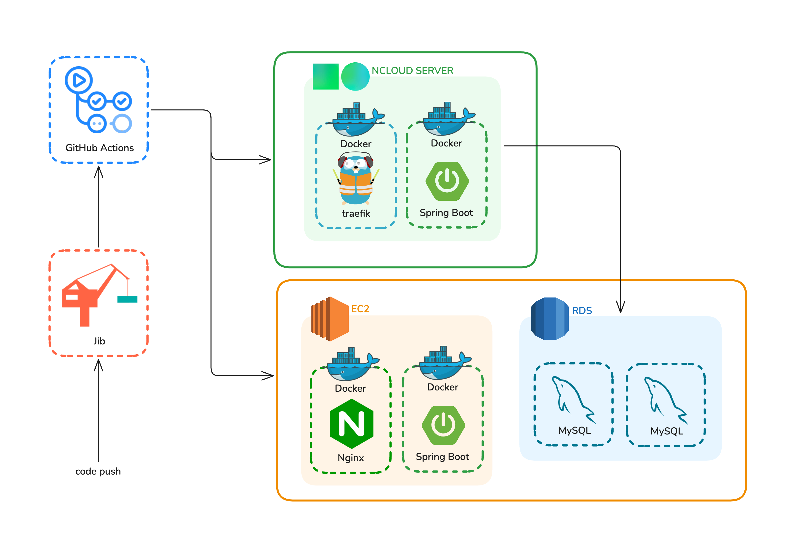

# 디프만의 모든 활동을 지원하는, DPM CORE

<p align="center">
  
</p>

---
## 🛠 Tech Stack


<br>


<br>


---

## 🏗️System Architecture
<p align="center">
  
</p>

---

## 🧱 Module Structure

### 프로젝트 모듈 구조

```
root
├── .github
├── application # API/유스케이스
├── codegen # jOOQ DSL 생성 모듈
├── domain # 순수 도메인 모델
├── entity # JPA 엔티티
└── persistence # DB 접근 (jOOQ, Spring Data JPA)
```

* 멀티 모듈 구조를 사용하여 **의존성 방향을 명확히** 관리합니다.
* 도메인 모듈은 순수 POJO로 유지하여 **비즈니스 로직의 독립성**을 보장합니다.
* `./gradlew:codegen jooqGenerate` 명령어로 jOOQ DSL 클래스를 생성합니다.

### 도메인 모듈 구조

```
foo-domain
  └─ aggregate # 도메인 객체
  └─ enums
  └─ port # inbound: usecase / outbound: persistence port
  └─ vo # 값 객체, 식별자 등
  └─ constant
  └─ event # 도메인 이벤트
```

---

## 👨🏻‍💻Contributors

### 2nd Developers
|  |  |
|:-------------------------------------------------:|:------------------------------------------------:|
|                      **정준원**                      |                     **이서현**                      |


### 1st Developers
|  |  |  |
|:-------------------------------------------------:|:--------------------------------------------:|:--------------------------------------------:|
|                      **정준원**                      | **이한음** |                   **신민철**                    |

---
## 📐 Team Rules
- 팀 내부 결정 사항은 Issue, Suggestion 등의 형태로 내부 논의 후 결정
  - [특정 정책에 대한 하드 코딩 관리(feat. 세션 시작 시간 14시)](https://github.com/depromeet/dpm-core-server/issues/33)
  - [멀티 모듈 아키텍처에 대한 질문입니다.(각 모듈에 대한 의문 제기)](https://github.com/depromeet/dpm-core-server/issues/172)
- 이유가 있고, 모두가 동의하는 방식의 의사결정
  - [JPA Entity와 schema.sql의 불일치로 인한 잠재적 위험 (jOOQ DSL codegen으로 인한 순환 참조 문제)](https://github.com/depromeet/dpm-core-server/issues/164)
  - [커스텀 에러 코드 관련 논의입니다.](https://github.com/depromeet/dpm-core-server/issues/60)
  - [Response 에서 시각(datetime)데이터 타입 논의](https://github.com/depromeet/dpm-core-server/issues/63)
